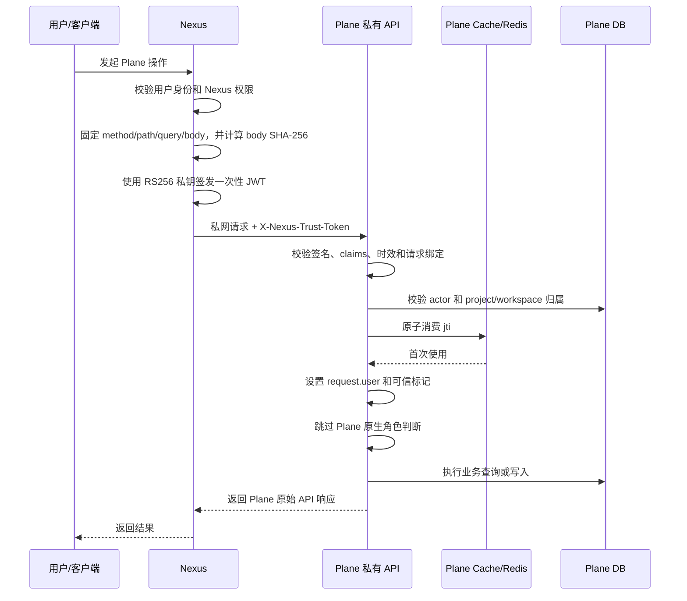

# Plane–Nexus 信任通道使用说明和流程

## 1. 用途

信任通道用于让 Nexus 在完成登录校验和授权判断后，以真实 Plane 用户身份调用 Plane `/api/v1/`。

通过可信认证的请求可以绕过 Plane 原生的角色、membership、owner permission 和 `allow_permission` 判断，覆盖 GET、HEAD、OPTIONS、POST、PUT、PATCH、DELETE 等 HTTP 方法。Plane 仍会执行资源存在性、workspace/project 归属、请求参数、serializer、归档状态等业务校验，因此“可信放行”不等于所有请求固定返回成功。

通道使用 RS256 非对称签名：

- Nexus 保存私钥，并为每次 HTTP 请求签发一个短时、一次性的 JWT。
- Plane 只保存公钥，用公钥验证 JWT，不能自行签发令牌。
- JWT 与真实请求的 method、path、原始 query string、workspace 和原始 body 字节绑定。
- Plane 根据 JWT 中的 `actor_plane_id` 设置 `request.user`，确保活动和审计归因到真实操作人。
- 同一个 `jti` 只能使用一次。

## 2. 请求流程



如果 Nexus 判权失败，不应向 Plane 签发令牌或发送可信请求。

## 3. Plane 端启用

### 3.1 生成密钥

密钥应在 Nexus 的安全环境中生成。私钥只能保存在 Nexus，不能复制到 Plane：

```bash
openssl genpkey -algorithm RSA -pkeyopt rsa_keygen_bits:2048 -out nexus-trusted-private.pem
openssl rsa -pubout -in nexus-trusted-private.pem -out nexus-trusted-public.pem
chmod 600 nexus-trusted-private.pem
```

### 3.2 配置 Plane

将公钥写入 `apps/api/.env`。PEM 可以使用真实换行，也可以写成转义后的 `\n`：

```env
NEXUS_TRUSTED_JWT_PUBLIC_KEY="-----BEGIN PUBLIC KEY-----\n...\n-----END PUBLIC KEY-----"
NEXUS_TRUSTED_JWT_PREVIOUS_PUBLIC_KEY=""
NEXUS_TRUSTED_JWT_ISSUER="nexus"
NEXUS_TRUSTED_JWT_AUDIENCE="plane"
NEXUS_TRUSTED_JWT_MAX_TTL_SECONDS=60
NEXUS_TRUSTED_JWT_CLOCK_SKEW_SECONDS=5
NEXUS_TRUSTED_RATE_LIMIT="600/minute"
```

配置说明：

| 变量 | 必需 | 默认值 | 说明 |
| --- | --- | --- | --- |
| `NEXUS_TRUSTED_JWT_PUBLIC_KEY` | 是 | 空 | 当前 Nexus 私钥对应的 RS256 公钥；为空时通道关闭 |
| `NEXUS_TRUSTED_JWT_PREVIOUS_PUBLIC_KEY` | 否 | 空 | 密钥轮换期间临时接受的上一把公钥 |
| `NEXUS_TRUSTED_JWT_ISSUER` | 否 | `nexus` | 必须与 JWT `iss` 一致 |
| `NEXUS_TRUSTED_JWT_AUDIENCE` | 否 | `plane` | 必须与 JWT `aud` 一致 |
| `NEXUS_TRUSTED_JWT_MAX_TTL_SECONDS` | 否 | `60` | JWT 最大生命周期，令牌自身不能声明更长时间 |
| `NEXUS_TRUSTED_JWT_CLOCK_SKEW_SECONDS` | 否 | `5` | Nexus 与 Plane 的时钟偏差容忍值 |
| `NEXUS_TRUSTED_RATE_LIMIT` | 否 | `600/minute` | 按 `actor_plane_id` 计算的可信请求限流 |

修改环境变量后需要重新创建 API 容器；普通 `restart` 不保证重新读取 `.env`：

```bash
docker compose up -d --force-recreate api
docker exec api python manage.py check
```

仅修改公钥等环境变量时不需要重新构建镜像。部署了新代码时，应先执行：

```bash
docker compose build api
docker compose up -d api
```

## 4. JWT 协议

只允许 `RS256`。每个 JWT 必须包含下列 claims：

| Claim | 类型 | 内容 |
| --- | --- | --- |
| `iss` | string | 默认 `nexus` |
| `aud` | string | 默认 `plane` |
| `actor_plane_id` | string | 当前真实操作人的 Plane User UUID；用户必须存在且启用 |
| `method` | string | 大写 HTTP 方法，如 `GET`、`POST` |
| `path` | string | Plane 收到的完整原始路径，如 `/api/v1/workspaces/acme/projects/` |
| `query` | string | 未解码、未重排、不含 `?` 的原始 query string；没有时为空字符串 |
| `workspace_slug` | string | workspace 路由中的真实 slug；非 workspace 路由为空字符串 |
| `body_sha256` | string | 对最终发送的 HTTP 原始 body 字节计算的小写十六进制 SHA-256 |
| `iat` | number | 签发时间，Unix 时间戳 |
| `exp` | number | 过期时间，必须晚于 `iat` 且生命周期不超过 Plane 配置上限 |
| `jti` | string | 每个请求唯一的令牌 ID，长度 1–128 字符，不得复用 |

### 4.1 请求绑定规则

Nexus 必须先生成最终请求，再签名：

1. 固定 HTTP method。
2. 固定 Plane path。
3. 固定 query 参数的顺序和编码，得到原始 query string。
4. 将请求体序列化为最终字节。
5. 对最终 body 字节计算 SHA-256。
6. 生成新 `jti`，签发 JWT。
7. 不再修改 path、query 或 body，将相同字节发送给 Plane。

对于没有 body 的 GET、HEAD、OPTIONS、DELETE，请对空字节 `b""` 计算 SHA-256，而不是省略 `body_sha256`。

JSON 的空格、换行、字段顺序都会改变原始 body hash。签名后重新执行一次 JSON 序列化会导致认证失败。

### 4.2 Python 签发示例

```python
import hashlib
import json
import time
from uuid import uuid4

import jwt


method = "POST"
path = "/api/v1/workspaces/acme/projects/PROJECT_ID/work-items/"
query = ""
workspace_slug = "acme"
body = json.dumps(
    {"name": "Created through Nexus"},
    ensure_ascii=False,
    separators=(",", ":"),
).encode("utf-8")

now = int(time.time())
claims = {
    "iss": "nexus",
    "aud": "plane",
    "actor_plane_id": "USER_UUID",
    "method": method,
    "path": path,
    "query": query,
    "workspace_slug": workspace_slug,
    "body_sha256": hashlib.sha256(body).hexdigest(),
    "iat": now,
    "exp": now + 60,
    "jti": uuid4().hex,
}

with open("nexus-trusted-private.pem", "rb") as key_file:
    token = jwt.encode(claims, key_file.read(), algorithm="RS256")
```

发送时必须使用生成 hash 的同一个 `body`：

```python
import httpx

response = httpx.request(
    method,
    f"http://api:8000{path}",
    content=body,
    headers={
        "Content-Type": "application/json",
        "X-Nexus-Trust-Token": token,
    },
)
```

不要同时发送 `X-Api-Key` 和 `X-Nexus-Trust-Token`。Plane 会拒绝混合凭据。

## 5. 读取请求示例

GET 同样需要每次签发新 JWT：

```text
GET /api/v1/workspaces/acme/projects/?per_page=50
X-Nexus-Trust-Token: <one-time-jwt>
```

对应 claims 必须包含：

```json
{
  "method": "GET",
  "path": "/api/v1/workspaces/acme/projects/",
  "query": "per_page=50",
  "workspace_slug": "acme",
  "body_sha256": "e3b0c44298fc1c149afbf4c8996fb92427ae41e4649b934ca495991b7852b855"
}
```

如果实际请求改为 `?per_page=50&cursor=...`，或 query 参数顺序发生变化，必须重新签发令牌。

## 6. 网络要求

可信 Header 不能通过 Plane 的公网 Caddy 入口发送。CE 和 AIO Caddy 都会删除 `X-Nexus-Trust-Token`，这是防止外部客户端直接触发信任通道的安全边界。

Nexus 应通过私有网络直连 Plane API，例如同一 Compose 网络中的：

```text
http://api:8000/api/v1/...
```

如果 Nexus 和 Plane 属于不同 Compose 项目，需要显式加入同一个受控 Docker network，或使用其他不对公网开放的内部入口。不要因为持有有效 JWT 就改走公网域名。

## 7. Plane 的校验顺序

Plane 收到 `X-Nexus-Trust-Token` 后依次执行：

1. 确认没有同时携带 `X-Api-Key`。
2. 确认 Plane 已配置当前公钥或上一把公钥。
3. 仅以 RS256 校验签名。
4. 校验 issuer、audience、必填 claims、`iat` 和 `exp`。
5. 精确比较 method、path、原始 query、workspace slug 和原始 body SHA-256。
6. 在能识别 project ID 时，确认 project 属于 path 中的 workspace。
7. 拒绝请求体任意层级的审计归因字段。
8. 确认 `actor_plane_id` 对应有效的 Plane 用户。
9. 通过共享 cache/Redis 原子消费 `jti`；缓存不可用时失败关闭。
10. 设置 `request.user`、`request.is_trusted_nexus_call` 和可信 claims。
11. 按 actor 执行可信请求限流。
12. 跳过 Plane 原生角色权限判断，继续执行接口业务逻辑。

被禁止的审计归因字段包括：

```text
actor
actor_id
created_by
created_by_id
updated_by
updated_by_id
```

这些字段在 JSON 的嵌套对象、数组、form 和 multipart 中出现都会导致可信认证失败。

## 8. 重试规则

每个 JWT 是一次性的。Plane 在认证成功时消费 `jti`，因此：

- 网络超时后不能使用原 JWT 重试。
- Nexus 必须使用相同的最终请求重新计算绑定字段，并生成新的 `jti` 和 JWT。
- 对非幂等写操作，Nexus 还应使用业务幂等键或先查询操作结果，避免“Plane 已写入但响应丢失”导致重复业务写入。
- GET 请求重试也必须签发新 JWT。

## 9. 密钥轮换

建议按以下顺序轮换，避免中断服务：

1. Nexus 生成新私钥和新公钥，但暂时继续用旧私钥签名。
2. Plane 将新公钥配置为 `NEXUS_TRUSTED_JWT_PUBLIC_KEY`，旧公钥配置为 `NEXUS_TRUSTED_JWT_PREVIOUS_PUBLIC_KEY`。
3. 重新创建 Plane API 容器。
4. Nexus 切换到新私钥签名。
5. 等待旧令牌最大 TTL 与时钟偏差窗口结束。
6. 清空 `NEXUS_TRUSTED_JWT_PREVIOUS_PUBLIC_KEY`，再次重新创建 API 容器。

Plane 会依次尝试当前和上一把公钥。Plane 侧永远不需要 Nexus 私钥。

## 10. 常见失败

| 现象 | 常见原因 |
| --- | --- |
| 提示可信认证未配置 | `NEXUS_TRUSTED_JWT_PUBLIC_KEY` 为空，或修改 `.env` 后没有重新创建容器 |
| token invalid | 公私钥不匹配、算法不是 RS256、issuer/audience 不一致、令牌过期或必填 claim 缺失 |
| method/path/query/workspace/body 不匹配 | Nexus 签名后修改了请求，JSON 被重新序列化，query 顺序或编码发生变化 |
| actor invalid/not found/inactive | `actor_plane_id` 不是有效 UUID，用户不存在或已停用 |
| token already used | `jti` 被重复使用；重试必须签发新 JWT |
| replay protection unavailable | Plane cache/Redis 不可用；实现会失败关闭 |
| project does not belong to workspace | path 中的 project 和 workspace 不匹配 |
| audit attribution 被拒绝 | 请求体包含 `actor`、`created_by`、`updated_by` 等保留字段 |
| 请求被限流 | 同一 actor 超过 `NEXUS_TRUSTED_RATE_LIMIT` |
| 经公网请求仍像未认证 | Caddy 按设计删除了可信 Header，应改用私有 API 地址 |
| 认证成功但接口仍返回业务错误 | 资源不存在、参数/serializer 校验失败、资源已归档或违反其他业务约束 |

认证错误在当前 DRF 路径下通常表现为 403；限流返回 429。调用方应以响应内容和服务日志区分具体原因，不应遇到认证失败后自动降级为共享 API Key。

## 11. 上线检查清单

- [ ] Nexus 私钥只存在于 Nexus 的 secret 管理中，文件权限受限。
- [ ] Plane 只配置公钥，未保存私钥。
- [ ] Plane 和 Nexus 的 issuer、audience、TTL 约定一致。
- [ ] 两端系统时间已同步。
- [ ] Nexus 使用私有地址访问 Plane，没有经过公网 Caddy。
- [ ] Plane API 使用共享且可用的 cache/Redis，以支持一次性 `jti`。
- [ ] 每次请求在最终序列化完成后再签名，并使用唯一 `jti`。
- [ ] Nexus 不同时发送 API Key 和可信令牌。
- [ ] Nexus 写请求不发送受保护的审计归因字段。
- [ ] 已验证可信 GET 和可信写请求。
- [ ] 已验证错误签名、过期令牌、请求绑定不匹配和 replay 均被拒绝。
- [ ] 已验证公网入口会删除 `X-Nexus-Trust-Token`。

## 12. 当前 Plane 实现位置

- 认证和请求绑定：`apps/api/plane/api/middleware/api_authentication.py`
- permission 与装饰器旁路：`apps/api/plane/app/permissions/`
- API 基类认证和限流：`apps/api/plane/api/views/base.py`
- compat 路由认证覆盖：`apps/api/plane/api/views/compat.py`
- actor 限流：`apps/api/plane/api/rate_limit.py`
- 环境变量示例：`apps/api/.env.example`
- 公网 Header 剥离：`apps/proxy/Caddyfile.ce`、`apps/proxy/Caddyfile.aio.ce`
